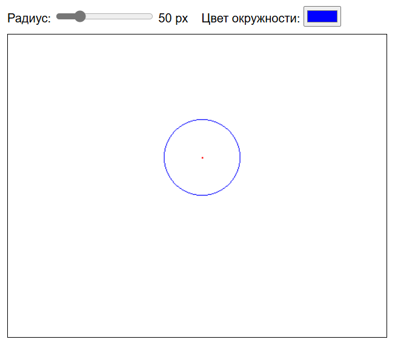

# Рисуем окружность по алгоритму Брезенхема
Страница содержит 1 ползунок настройки радиуса и палитра.
В палитре можно выбрать цвет линии. Для постройки окружности, 
нужно кликнуть левой кнопкой мыши по свободной области.

# Работа алгоритма
Алгоритм строит окружность по 1/8.
1. Нужно вычислить d, для определения в какой пиксель мы пойдём (вертикальный, горизонтальный, диагональный)
2. По сравнениям определяем направления движения алгоритма
3. Получив координату одной точки, отображаем её симметрично 7 раз

# Скриншотик

